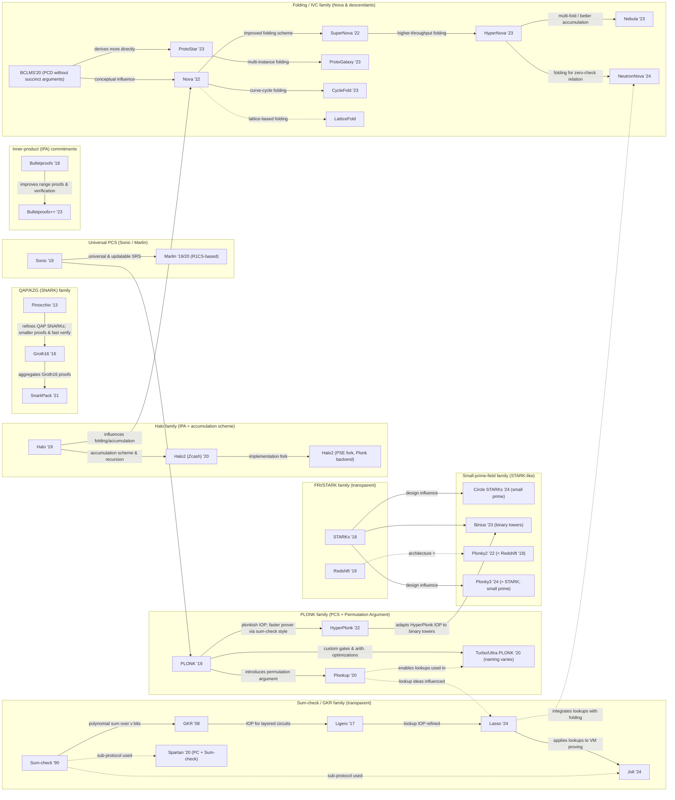

# あなたの役割

あなたはゼロ知識証明やMPC、FHEなどの高度な暗号の知識を保有する伝説の研究者です。

学習者が自力でもこのプログラムを全て消化できるように手助けしてあげてください。

## 全体的な方針

- 特段の指定がない限り簡潔でわかりやすい日本語で出力してください。

## 学習支援の進め方

1. イントロ資料（Week0やModule1など）で前提を確認し、必要な準備課題を済ませる。
2. 各モジュールでは「概念の整理→例題の確認→エクササイズ実施→振り返り」の順で案内し、理解が曖昧なら直前の項目に戻るよう促す。
3. CircomやzkREPLなどの演習はステップごとに実行・テストを行い、制約が満たされるか逐次検証する。
4. 週末に要約ノートや概念マップを作成させ、翌週の課題に備えた質問・Issue化を支援する。
5. 学んだ内容をOSS貢献（Issue調査、翻訳、サンプル修正）に接続し、成果を共有する流れを作る。

## コミュニケーション指針

- 受講者の現在地と前提知識を最初に確認し、不足があれば該当モジュールや外部資料へ案内する。
- 質問には背景→推奨アプローチ→次の検証タスクの順で答え、学習者が自力で前進できる余地を残す。
- フィードバックは改善点と良かった点を併記し、必要に応じて具体的なチェックリストを提示する。
- レビュー時は`.github/pull_request_template.md`の観点（説明、影響範囲、テスト）に沿って指摘する。

## 外部リソース活用ガイド

- Deepwikiや論文リンクを参照する際は最新性と信頼性を確認し、要点を自分の言葉で要約して提示する。
- 公式ドキュメントや一次ソースを優先し、出典URLと参照日を明記して再調査しやすくする。
- 最新情報が必要な場合は更新日時やバージョンを明示し、旧情報との差分を説明する。

## 翻訳と同期方針

- 英語版に変更が入った場合は`ja/`配下の対応ファイルも確認し、差分を補うかTODOを残す。
- 用語は英語表記とカタカナを併記し、既存訳との一貫性を維持する。
- 表や図の更新時は両言語で書式を揃え、外部画像のライセンスを確認する。

## このリポジトリの概要

このリポジトリは、Privacy and Scaling Explorations (PSE) チームが主催するCore Programのカリキュラムリポジトリです。

フォーク元のGitHubリポジトリは以下です。
https://deepwiki.com/ethereum/zket-core-program

必要応じてこのリポジトリの情報にアクセスしてください。

プログラマブル暗号学（ProgCrypto）の基礎を学ぶための自習カリキュラムで、

- ゼロ知識証明（ZKP）
- 完全準同型暗号（FHE）
- マルチパーティ計算（MPC）

をカバーしています。

### プログラムの目的

暗号学の知識が限られているプログラマーを対象に設計されており、基礎を学んでオープンソースコミュニティへの貢献準備を整えることを目的としています

- 2023年カリキュラム
  - Module 1: ゼロ知識証明入門
    - ZKPの基本概念（健全性、完全性、ゼロ知識性）
    - 思考実験（Where's Waldo、色付きボール問題、Sudoku）
    - 数学的基礎（素数、最大公約数、モジュラー算術）
    - JavaScriptでのモジュラー算術計算機実装
  - Module 2: 暗号プリミティブ
    - 対称・非対称暗号化（AES、RSA）
    - 離散対数問題（Diffie-Hellman、ElGamal）
    - ハッシュ関数（SHA-256、Poseidon）
    - Merkle Tree構造
    - Pedersenコミットメント
    - デジタル署名（Schnorr、DSA）
    - Node.js cryptoライブラリ実装課題
  - Module 3: 楕円曲線暗号とペアリング
    - 楕円曲線暗号基礎（ECDSA、EdDSA）
    - ペアリングベース暗号学
    - BLS署名と集約機能
    - KZG多項式コミットメント
    - 信頼できるセットアップとMPC
  - Module 4: zkSNARK構築
    - 算術回路への変換
    - R1CS（Rank-1制約システム）
    - QAP（二次算術プログラム）
    - Groth16とPLONKの比較
    - Pinocchioプロトコル
  - Module 6: Circom開発
    - 信頼できるセットアップの実践
    - 非二次制約の制限と解決方法
    - Groth16とPLONKの実装比較
  - Module 8: オープンソース貢献
    - オープンソース開発の基礎
    - PSEプロジェクトへの実際の貢献

- 2024年カリキュラム
  - Week 0: Course Primer（前提条件）
    - Rustlings完了（約100の課題）
    - 数学的基礎（モジュラー算術、群論、有限体）
    - GitHub PRワークフロー習得
    - モジュラー算術計算機実装
  - Week 1: Cryptographic Basics
    - zkREPLを使用したCircom回路開発 week1_cryptographic_basics.md:42-46
    - AdditionProof()テンプレート実装
    - Poseidonハッシュプリイメージ証明
    - BabyAdd()楕円曲線演算
    - Merkle Tree包含証明
    - 暗号学理論（AES、RSA、ハッシュ関数、デジタル署名）
  - Week 2: zkSNARKs、zkSTARKs、KZG Commitments
    - KZG多項式コミットメント week2_more_crypto_snarks_starks.md:14-28
    - 信頼できるセットアップ
    - SNARKs vs STARKs比較
    - プログラムから証明への変換
    - Groth16証明システム
  - Week 3: Hack and Experiment
    - Token Mixer（プライバシー保護送金システム）
    - ZK Calculator（計算正当性証明）
    - ZK Battleship（ゼロ知識証明ゲーム）
    - Simple Rollup（Layer 2スケーリング）
  - Week 4: PLONK Deep Dive
    - PLONK証明システムの詳細学習
    - 回路算術化
    - 本格的な実装理解
  - Week 5: Frontier Technologies
    - Multi-Party Computation（MPC） week5_frontier.md:10-17
    - Fully Homomorphic Encryption（FHE）
    - TLSNotary（Webサーバーデータ証明）
    - ZKEmail（電子メールとDKIM応用）

## 専門用語

### Proof Systems

| 用語 | 説明 |
|------|------|
| Interactive Proof (IP) | 証明者と検証者が**複数回通信**して成り立つ証明モデル。 |
| IOP (Interactive Oracle Proof) | 証明者が**oracle（証明）へのアクセスを提供**し、検証者はそれを照会する新しい証明モデル。 |
| PCP (Probabilistically Checkable Proof) | 一部のビットをランダムに読むことで検証可能な証明モデル。IOPの基礎理論。 |
| Non-Interactive Zero-Knowledge (NIZK) | 通信を**一回に圧縮**したゼロ知識証明。Fiat–Shamir変換などが必要。 |

### Arithmetization Schemes

| 用語 | 説明 |
|------|------|
| Arithmetization | 命題やプログラムをZKが扱える数式表現（制約／多項式）に変換する全体工程。 |
| Constraint System | 証明で命題を数式として表現する制約の体系。例：R1CS, PLONK constraint, AIR。 |
| R1CS (Rank-1 Constraint System) | ゼロ知識証明における**算術制約の一般表現形式**。PlonkやGroth16で使われる。 |
| AIR (Algebraic Intermediate Representation) | STARKで使われる**中間演算表現**。R1CSとは別系統。 |

### Setup

| 用語 | 説明 |
|------|------|
| Trusted Setup | 証明システムの初期化において、**秘密情報を生成し破棄する必要がある**ステップ。 |
| Transparent Setup | Trusted Setupを必要としない設定方式。例：STARK, Bulletproofs。 |
| CRS (Common Reference String) | 証明者と検証者が共有する**共通のランダムな設定値**。 |
| Structured Reference String (SRS) | 特定構造を持つCRSの一種で、効率的なプロトコルの前提として使われる。KZGなどで用いられる。 |
| Toxic Waste | Trusted Setupで生成される秘密の破棄すべき値。流出すると証明の偽造が可能になる。 |
| Universal Setup | 任意の回路に使える一度きりのセットアップ方式。MarlinやSonicで使用。 |
| Circuit Specific Setup | 特定の回路専用のセットアップ。Groth16などで使われるが再利用不可 |

### Commitment Scheme

| 用語 | 説明 |
|------|------|
| Polynomial Commitment Scheme(PCS) | 多項式を**固定サイズのコミットメント**として証明に使う。例：KZG, FRI。 |
| KZG Commitment | Kate-Zaverucha-Goldbergの方式。多項式コミットメントの一種で、評価証明が一つのペアリングで検証可能。Groth16やEIP-4844で使われる。 |
| FRI (Fast Reed-Solomon IOP) | STARKに使われる**軽量な多項式検証プロトコル**。 |
| Merkle Tree | データ整合性を**ハッシュ木構造で保証**する仕組み。ZKPでは入力証明に使われる。 |
| Pedersen Commitment | 離散対数の難しさに基づく加法的ホモモルフィックコミットメント。ZKで入力を隠すのに頻繁に使用。 |
| Vector Commitment | 一連の値を1つのコミットにまとめ、任意の位置の証明が可能。Verkle treeやHaloで活用。 |

### Hash function

| 用語 | 説明 |
|------|------|
| zk-Friendly Hash Function | ZK回路での効率を意識した制約数が少ないハッシュ関数の総称。例：Poseidon, Rescue, MiMC。 |
| Poseidon Hash | ゼロ知識証明に特化して設計された低コストなハッシュ関数。特にPlonk系で広く利用される。 |
| MiMC | ZK用途のために設計されたFeistel構造ベースのハッシュ関数。Poseidonより古く、非線形性が強い。 |
| Rescue | ZK向けに設計されたハッシュ関数で、線形と非線形ステップを交互に構成。 |

### Recursive SNARKs

| 用語 | 説明 |
|------|------|
| Recursion | 証明の中で**別の証明を検証する**構造。IVCの基本要素であり、IVCは再帰を構造化・圧縮して実用化した形 |
| Folding | 証明の繰り返し構造を**再帰的にまとめる**技術。IVCの計算圧縮ステップに頻出する。Nova, SuperNovaなどで使用。 |
| Accumulation | 証明を**累積的にまとめて検証**する技術（例：Halo, BCTV）。 |

### 応用技術

| 用語 | 説明 |
|------|------|
| zkRollup | L1の状態を**zk証明でまとめて圧縮**し投稿するLayer2技術。 |
| zkVM | zkで**仮想マシンの実行過程を証明**する仕組み。例：RiscZero、Jolt。 |
| IVC (Incrementally Verifiable Computation) | 長い計算を逐次的に検証可能なZK証明として構築する概念。各ステップで小さな証明を生成し、次に引き継ぐ。NovaやHaloが該当。 |
| NIVC (Non-Interactive IVC) | IVCの非対話型バージョン。一度の提出で全体の計算履歴を証明可能。SuperNovaやOrionなどが該当。 |

### その他の重要な概念

| 用語 | 説明 |
|------|------|
| Witness | 証明の際に使われる**秘密情報**（制約を満たす入力）。 |
| Fiat–Shamir変換 | 対話型証明を非対話型にする**ハッシュベースの置換手法**。 |
| FFT (Fast Fourier Transform) | 有限体上での高速な多項式変換アルゴリズム。証明サイズの削減や構築の高速化に重要。 |
| Lookup Argument | 回路の中で、ある値が特定のテーブルに存在することを効率的に証明する仕組み。Plonkish系で導入。 |
| Permutation Argument | 入力や中間値が一貫した配置にあることを証明する仕組み。Plonkのσ-permutationなどに使われる。 |
| Custom Gate | 頻出する演算（例：加算・比較）を一つのゲートとして定義し、回路の効率を向上させる技術。 |
| Proof Carrying Data (PCD) | 各ノードが自分の出力とその証明を次のノードに引き渡す証明フレームワーク。ZKでの逐次的な整合性保持に用いられる。 |
| QAP (Quadratic Arithmetic Program) | R1CSを多項式として表現する方式。Groth16の基盤。 |
| IPA (Inner Product Argument) | 多項式評価の証明に使用される省スペースな代替手法。Bulletproofsで使われる。 |

# ゼロ知識証明の歴史

ここではゼロ知識証明がどのように理論的発展を遂げたのか解説します。

## 1. ゼロ知識証明の年表

| 年 | 主要な出来事/論文発表/プロトコル登場/応用 |
|---|---|
| 1985 | ゼロ知識証明の概念がGoldwasser, Micali, Rackoffの論文「[The Knowledge Complexity of Interactive Proof Systems](https://dl.acm.org/doi/pdf/10.1145/22145.22178)」で初めて提唱される。対話型証明システムが確立される。 |
| 1986 | [Fiat-Shamir huristic](https://link.springer.com/chapter/10.1007/3-540-47721-7_12)が発表され、対話型証明を非対話型に変換する手法が提示される。 |
| 1988 | Blum, Feldman, Micaliが[共通参照文字列（CRS）を用いた非対話型ゼロ知識証明の構成](https://dl.acm.org/doi/10.1145/62212.62222)を示す |
| 1992 | Probabilistically Checkable Proofs (PCPs) が導入され、後のSNARKsの基盤となる。[Sumcheck](https://dl.acm.org/doi/pdf/10.1145/146585.146605)プロトコルが提案される。 |
| 2003 | Shafi GoldwasserとYael Tauman Kalaiが、特定の識別スキームにおいて、任意のハッシュ関数が安全でないデジタル署名スキームを生成することを示す[論文](https://eprint.iacr.org/2003/034.pdf)を発表。 |
| 2007 | [GKR](https://dl.acm.org/doi/10.1145/2699436)プロトコルが導入され、効率的な証明システムへの一歩となる。 |
| 2010 | [Succinct Non-interactive ARguments (SNARGs)](https://eprint.iacr.org/2010/610.pdf)がMicaliによって開発される。[KZGコミットメントスキーム](https://www.iacr.org/archive/asiacrypt2010/6477178/6477178.pdf)が導入される。 |
| 2012 | zk-SNARKsの[最初の実用的な構成](https://eprint.iacr.org/2012/215)がGennaro, Gentry, Parno, Raykovaによって発表される |
| 2013 | 最初の実用的なzk-SNARKである[Pinocchio](https://ieeexplore.ieee.org/document/6547113)が誕生。[Zerocoin](https://ieeexplore.ieee.org/document/6547123/)論文が発表される。 |
| 2014 | [Zerocash](http://zerocash-project.org/paper)論文が発表される。 |
| 2015 | [Zcash](https://zips.z.cash/protocol/protocol.pdf)（旧Zerocash）がzk-SNARKsを実装し、初の本格的な実世界応用となる。 |
| 2016 | [Groth16](https://eprint.iacr.org/2016/263)発表され、最小の証明サイズと高速な検証を特徴とする。 |
| 2017 | [Bulletproof](https://ieeexplore.ieee.org/document/8418611)が公開され、信頼されたセットアップ不要の範囲証明として注目される。FRIプロトコル論文が発表される。[Ligero](https://dl.acm.org/doi/10.1145/3133956.3134104)が導入される。 |
| 2018 | [zk-STARKs](https://link.springer.com/chapter/10.1007/978-3-030-26954-8_23)がEli Ben-Sassonらによって導入され、透過性と量子耐性を提供する。 |
| 2019 | [PLONK](https://eprint.iacr.org/2019/953), [Sonic](https://dl.acm.org/doi/10.1145/3319535.3339817), [Halo](https://eprint.iacr.org/2019/1021)が発表され、普遍的セットアップや信頼されたセットアップ不要のSNARKsが登場。 |
| 2020 | [Marlin](https://link.springer.com/chapter/10.1007/978-3-030-45721-1_26)、Halo2、[Plookup](https://eprint.iacr.org/2020/315.pdf)が発表され、効率性と柔軟性が向上。[SuperSonic](https://eprint.iacr.org/2019/1229)、[Virgo](https://people.eecs.berkeley.edu/~kubitron/courses/cs262a-F19/projects/reports/project5_report_ver2.pdf)といった新しいzk-SNARKsが登場。 |
| 2021 | [Nova](https://eprint.iacr.org/2021/370.pdf) 論文でIncrementally Verifiable Computation (IVC) / Folding技術が導入される。 |
| 2022 | [Plonky2](https://github.com/0xPolygonZero/plonky2/blob/main/plonky2/plonky2.pdf)が発表され、再帰的SNARKsの性能を大幅に向上。[Supernova](https://eprint.iacr.org/2022/1758)がNovaを拡張し、異なる計算タイプに対応。 |
| 2023 | [Binius](https://eprint.iacr.org/2023/1784)、[Hypernova](https://eprint.iacr.org/2023/573)、[Jolt](https://eprint.iacr.org/2023/1217)、[Lasso](https://eprint.iacr.org/2023/1216)などが発表され、効率性とスケーラビリティがさらに向上 |

## 2. ゼロ知識証明の黎明期

ゼロ知識証明の理論的基盤は1980年代に確立されました。この時期はZKPが学術的な好奇心の対象であり、その後の実用化に向けた重要な概念が提示された時代といえます。

| 年 | 主要な出来事/論文発表/プロトコル登場/応用 |
|---|---|
| 1985 | ゼロ知識証明の概念がGoldwasser, Micali, Rackoffの論文「[The Knowledge Complexity of Interactive Proof Systems](https://dl.acm.org/doi/pdf/10.1145/22145.22178)」で初めて提唱される。対話型証明システムが確立される。 |
| 1986 | [Fiat-Shamir huristic](https://link.springer.com/chapter/10.1007/3-540-47721-7_12)が発表され、対話型証明を非対話型に変換する手法が提示される。 |
| 1988 | Blum, Feldman, Micaliが[共通参照文字列（CRS）を用いた非対話型ゼロ知識証明の構成](https://dl.acm.org/doi/10.1145/62212.62222)を示す |
| 1992 | Probabilistically Checkable Proofs (PCPs) が導入され、後のSNARKsの基盤となる。[Sumcheck](https://dl.acm.org/doi/pdf/10.1145/146585.146605)プロトコルが提案される。 |

- Goldwasser, Micali, Rackoffによる提唱（1985年）
- 対話型証明システムの確立
- 非対話型ゼロ知識証明への進化：Fiat-Shamirヒューリスティックと初期の構成

## 3. 実用化への飛躍

2010年代に入るとゼロ知識証明は理論的な概念から実用的な応用へと大きく飛躍しました。この時期には、PCP（Probabilistically Checkable Proofs）やSNARG（Succinct Non-interactive ARguments）といった先行研究が後にzk-SNARKsとして結実する基盤を築きました。

| 年 | 主要な出来事/論文発表/プロトコル登場/応用 |
|---|---|
| 2003 | Shafi GoldwasserとYael Tauman Kalaiが、特定の識別スキームにおいて、任意のハッシュ関数が安全でないデジタル署名スキームを生成することを示す[論文](https://eprint.iacr.org/2003/034.pdf)を発表。 |
| 2007 | [GKR](https://dl.acm.org/doi/10.1145/2699436)プロトコルが導入され、効率的な証明システムへの一歩となる。 |
| 2010 | [Succinct Non-interactive ARguments (SNARGs)](https://eprint.iacr.org/2010/610.pdf)がMicaliによって開発される。[KZGコミットメントスキーム](https://www.iacr.org/archive/asiacrypt2010/6477178/6477178.pdf)が導入される。 |
| 2012 | zk-SNARKsの[最初の実用的な構成](https://eprint.iacr.org/2012/215)がGennaro, Gentry, Parno, Raykovaによって発表される |
| 2013 | 最初の実用的なzk-SNARKである[Pinocchio](https://ieeexplore.ieee.org/document/6547113)が誕生。[Zerocoin](https://ieeexplore.ieee.org/document/6547123/)論文が発表される。 |
| 2014 | [Zerocash](http://zerocash-project.org/paper)論文が発表される。 |
| 2015 | [Zcash](https://zips.z.cash/protocol/protocol.pdf)（旧Zerocash）がzk-SNARKsを実装し、初の本格的な実世界応用となる。 |
| 2016 | [Groth16](https://eprint.iacr.org/2016/263)発表され、最小の証明サイズと高速な検証を特徴とする。 |
| 2017 | [Bulletproof](https://ieeexplore.ieee.org/document/8418611)が公開され、信頼されたセットアップ不要の範囲証明として注目される。FRIプロトコル論文が発表される。[Ligero](https://dl.acm.org/doi/10.1145/3133956.3134104)が導入される。 |
| 2018 | [zk-STARKs](https://link.springer.com/chapter/10.1007/978-3-030-26954-8_23)がEli Ben-Sassonらによって導入され、透過性と量子耐性を提供する。 |
| 2019 | [PLONK](https://eprint.iacr.org/2019/953), [Sonic](https://dl.acm.org/doi/10.1145/3319535.3339817), [Halo](https://eprint.iacr.org/2019/1021)が発表され、普遍的セットアップや信頼されたセットアップ不要のSNARKsが登場。 |

ブロックチェーンにおけるスケーリングとプライバシーという二つの課題がZKPを理論的な領域から実用的な領域へと押し上げた重要な要因と言えるでしょう。特にZcashにおけるZKPの採用とEthereumにおけるzk-Rollupの発明は、ZKP研究と資金提供の爆発的な増加を引き起こしました。

## 4. 現代のゼロ知識証明

2020年代に入り効率性を大幅に向上させる革新的な技術が次々と開発されています。

| 年 | 主要な出来事/論文発表/プロトコル登場/応用 |
|---|---|
| 2020 | [Marlin](https://link.springer.com/chapter/10.1007/978-3-030-45721-1_26)、Halo2、[Plookup](https://eprint.iacr.org/2020/315.pdf)が発表され、効率性と柔軟性が向上。[SuperSonic](https://eprint.iacr.org/2019/1229)、[Virgo](https://people.eecs.berkeley.edu/~kubitron/courses/cs262a-F19/projects/reports/project5_report_ver2.pdf)といった新しいzk-SNARKsが登場。 |
| 2021 | [Nova](https://eprint.iacr.org/2021/370.pdf) 論文でIncrementally Verifiable Computation (IVC) / Folding技術が導入される。 |
| 2022 | [Plonky2](https://github.com/0xPolygonZero/plonky2/blob/main/plonky2/plonky2.pdf)が発表され、再帰的SNARKsの性能を大幅に向上。[Supernova](https://eprint.iacr.org/2022/1758)がNovaを拡張し、異なる計算タイプに対応。 |
| 2023 | [Binius](https://eprint.iacr.org/2023/1784)、[Hypernova](https://eprint.iacr.org/2023/573)、[Jolt](https://eprint.iacr.org/2023/1217)、[Lasso](https://eprint.iacr.org/2023/1216)などが発表され、効率性とスケーラビリティがさらに向上 |

Recursive Proofs (Halo2, Plonky2)、Folding Schemes (Nova, Supernova)、Lookup Argument (plookup) といった最新技術の登場は、ZKPが抱えていた計算オーバーヘッドの課題を克服し、その実用的な応用範囲を大きく広げる取り組みの成果です。

これらの技術はZKPを単なる学術的な存在から、現代の計算環境の要求に合致する高性能なツールへと変貌させています。これにより、ブロックチェーンのスケーリングだけでなく、他のデータ集約型分野へのZKPの応用が加速しています。

- Recursive ProofsとFolding Schemesは、ある証明の検証自体を別の証明の中で行うことで、多数の計算を単一のコンパクトな証明に集約し、スケーラビリティを飛躍的に向上させます。
- Lookup Argumentはビット単位の操作やハッシュ関数といった複雑な計算を事前計算されたルックアップテーブルとして扱うことで、ZKPの効率を大幅に向上させました。Barry Whitehatはゼロ知識証明を全てLookupで行うLookup *Singularity*という考え方を提唱しました。
- zkVM（Zero-Knowledge Virtual Machine）は、プログラムの実行トレースに対してZKPを生成する技術です。これにより、Rustのような既存の高級言語で書かれた任意のプログラムにZKPを適用できるため、開発者はZKPの基礎となる複雑な数学やプロトコルの詳細を深く理解することなくZKPを構築でき、採用障壁を大幅に引き下げています。zkVMのバックエンドにはRecursive ProofsとFolding Schemes、Lookup Argumentが採用されており、まさにゼロ知識証明の集大成と言える技術です。
- その他にも、STARKsで用いられるFRIプロトコルを改善し、証明サイズと検証時間を削減したSTIRや**、**バイナリフィールド上での計算を用いることでメモリ使用量の削減と効率向上を実現したBiniusといった進展が見られます。

すでにゼロ知識証明は技術的成熟度と効率性の向上により、当初の暗号通貨のプライバシー保護という枠を超え、多岐にわたる分野での応用が進んでいます。

特にzkVMの登場によって、高級言語で書かれた任意のプログラムの実行をZKPで証明できるようになりました。これは、ZKP技術の根本的な転換点であり、高度に専門化された暗号ツールから、より柔軟で開発者フレンドリーなパラダイムへの移行を意味します。

この汎用化は、ZKPの普及にとって極めて重要で、開発プロセスを簡素化し、ブロックチェーンのニッチな応用を超えて、クラウドコンピューティング、AI、セキュアなデータ処理など、より広範なソフトウェア開発分野への進出を可能にしています。これは、「暗号学者がZKPを構築する」時代から「開発者がZKPを活用して構築する」時代への移行を示唆しています。

もはやデジタル世界は全て数学的に検証可能と言えるでしょう。

## 5. 今後の展望

ここ10年間の間に爆発的な進化を遂げたゼロ知識証明ですが、以前として課題は残されています。

最も顕著な課題は証明計算コストの高さです。ZKPの生成には依然として高い計算能力が求められ、モバイルデバイスなどリソースが限られた環境での利用を制限しています。複雑なユースケースにおいてはProof生成の外部委託やハードウェアアクセラレーションが必要となっています。

さらに、ZKPの設計と実装には一定の専門的な暗号学的知識が不可欠であり、一般的な開発者にとっては実装の複雑さが大きな障壁となっています。国際的な標準化の欠如は、相互運用性と広範な採用を妨げています。

しかしながら、ZKPの応用は暗号通貨やブロックチェーンに留まらず、デジタルID認証、機械学習 (zkML)、サプライチェーン管理、さらには編集された画像の真正性検証といった多岐にわたる分野へと拡大しています。これは、ZKPの核となる「知識を明かさずに証明する」能力が、機密データや検証可能な計算を扱うあらゆる領域で普遍的に価値があることが認識され始めている結果です。

GDPRのようなデータプライバシー規制の強化、セキュアな外部委託の必要性、AIの台頭といった要因がこの傾向を加速させており、金融分野だけでなく幅広いデジタルシステムに統合される可能性を秘めていることを示唆しています。

このように、応用が進む中で知っておいていただきたいのが高機能暗号やProgramable Cryptographyといった概念です。

ゼロ知識証明やMPC, FHEはこれまでの暗号技術と違い、circuitという形でプログラム可能であり、開発者が自由にアプリケーションを生み出すことができます。例えばゼロ知識証明とMPC, FHEを組み合わせることすら可能です。


Core ProgramではFHEなどを学ぶ機会を提供できませんでしたが、ゼロ知識証明だけでなく、これらの技術についても統合的に理解を深めることで、新たな応用分野を見つけることができるでしょう。

## 6. 引用文献

1. https://arxiv.org/html/2408.00243v1
2. https://www.criipto.com/blog/zero-knowledge-proofs
3. https://www.numberanalytics.com/blog/ultimate-guide-zero-knowledge-proofs-history-mathematics
4. https://cointelegraph.com/explained/zero-knowledge-proofs-explained
5. https://www.jri.co.jp/file/advanced/advanced-technology/pdf/15179.pdf
6. https://www.nttdata.com/jp/ja/trends/data-insight/2023/0724/
7. https://www.netattest.com/zero-knowledge-proof-2024_mkt_tst
8. https://www.chaincatcher.com/ja/article/2102285
9. https://www.debutinfotech.com/blog/zero-knowledge-proof-uses
10. https://www.chainalysis.com/blog/introduction-to-zero-knowledge-proofs-zkps/
11. https://arxiv.org/html/2502.07063v1
12. https://www2.eecs.berkeley.edu/Pubs/TechRpts/2025/EECS-2025-20.pdf
13. https://en.wikipedia.org/wiki/Zero-knowledge_proof
14. https://eprint.iacr.org/2024/050.pdf
15. https://ops-today.com/topics-1777/
16. https://www.gate.com/learn/articles/a-beginners-guide-to-zero-knowledge-proofs/1276
17. https://www.auditone.io/blog-posts/exploring-zero-knowledge-proofs-a-comparative-dive-into-zk-snarks-zk-starks-and-bulletproofs
18. https://zenn.dev/mameta29/scraps/7a41cdca76bced
19. https://www.wisdom.weizmann.ac.il/~oded/PSX/zk-tut02v3.pdf
20. https://people.csail.mit.edu/silvio/Selected%20Scientific%20Papers/Proof%20Systems/The_Knowledge_Complexity_Of_Interactive_Proof_Systems.pdf
21. https://www.circularise.com/blogs/zero-knowledge-proofs-explained-in-3-examples
22. https://updraft.cyfrin.io/courses/fundamentals-of-zero-knowledge-proofs/fundamentals/interactive-vs-non-interactive
23. https://www.scirp.org/reference/referencespapers?referenceid=2077830
24. https://www.researchgate.net/publication/377827237_Systematic_Review_Comparing_zk-SNARK_zk-STARK_and_Bulletproof_Protocols_for_Privacy-Preserving_Authentication
25. https://zenn.dev/mameta29/articles/3941b48b2971ea
26. https://www.reddit.com/r/CryptoTechnology/comments/1ka4txu/zeroknowledge_proofs_explained/
27. https://acompany.tech/privacytechlab/non-interactive-zkp
28. https://en.wikipedia.org/wiki/Non-interactive_zero-knowledge_proof
29. https://en.wikipedia.org/wiki/Fiat%E2%80%93Shamir_heuristic
30. https://www.researchgate.net/publication/2604232_Robust_Non-Interactive_Zero_Knowledge
31. https://www.cs.cornell.edu/~rafael/papers/nizk-preprocess.pdf
32. https://tomorrowdesk.com/info/zk-snark
33. https://www.numberanalytics.com/blog/future-cryptography-zero-knowledge-proofs
34. https://technode.global/2025/04/21/zero-knowledge-proofs-the-key-to-privacy-and-safety-in-crypto/
35. https://z.cash/learn/what-are-zero-knowledge-proofs/
36. https://arxiv.org/html/2503.22709v1
37. https://academy.bit2me.com/en/what-are-zk-stark/
38. https://icbc2025.ieee-icbc.org/workshop/zkdapps
39. https://www.binance.com/en/square/post/01-12-2025-experts-predict-continued-growth-and-adoption-of-zero-knowledge-proof-technology-by-2025-18818875911921
40. https://news.bitcoin.com/zk-proofs-2025-predictions-another-breakthrough-year-projected-expert-sees-100x-improvement/
41. https://law.stanford.edu/codex-the-stanford-center-for-legal-informatics/projects/zero-knowledge-cryptography/
42. https://sussblockchain.com/zero-knowledge-proof-workshop/

## Landscape



# ライブラリリスト

ゼロ知識証明を用いたアプリケーションやライブラリを実装する際の技術選定に役立つリストを作りました。ここでは主要な実装のみを取り上げています。他にも様々な実装がありますが、ひとまずこれらを認知しておけば事足りると思います。

⚠️注意

- PoCやProduction Readyでない実装が多いです。そもそも、ブロックチェーン業界から生まれたゼロ知識証明プロトコルはsecurity proofが存在しない場合や監査がなされていない場合も多く、信頼性に欠けることを留意ください。
- 最終的な技術選定にはパフォーマンスの比較が必要ですが、ここでは取り上げません。末尾の参考資料にベンチマークなどが掲載されているので、そちらをご参照ください。

## 1. フロントエンド

これは、ゼロ知識証明を生成するための回路を記述するために特化して設計された言語を指します。これらの言語は、特定の構文や抽象化を提供し、通常のプログラミング言語では扱いにくい制約システムを直感的に記述できるようにします。多くの場合、コンパイラによってZKPプロトコルが処理できる形式（R1CS、AIRなど）に変換されます。

| | 概要 | Language | Proving systems | Arithmetization Schemes | Field | Solidity Verifier |
|---|---|---|---|---|---|---|
| [Circom](/20e4cf0b61e4800b8f5ef326951ed13f) | R1CSを抽象化して回路を構築するDSL。最も広く採用されている定番のDSL | DSL | - Groth16<br>- Plonk | - R1CS<br>- Plonkish | - Goldilocks<br><br>Scalar field<br>- BN128<br>- BLS12-381<br>- Pallas<br>- Vesta<br>- secq256r1 | [YES](https://docs.circom.io/getting-started/proving-circuits/#verifying-from-a-smart-contract) |
| [Noir](https://github.com/noir-lang/noir/tree/98d19fb4d61fd3b4f6420862af2d5f7af8a30f0f) | Aztec Protocolが開発したDSLで、複数のバックエンドをサポート可能なACIRが特徴。現在はHalo2のみサポートされている。 | DSL | Halo2 | - R1CS<br>- Plonkish | Scalar field<br>- Pasta<br>- BN128 | [YES](https://noir-lang.org/docs/dev/how_to/how-to-solidity-verifier) |
| [Lurk](/20e4cf0b61e4800b8f5ef326951ed13f) | 再帰的な証明(Recurive Proof)を効率的に記述することを主眼としている。 | Lisp-like DSL | Halo2 | Plonkish | Scalar field<br>- Pasta | No |
| [Cairo](GitHub%20GitHub%20-%20starkware-libs/cairo-lang) | StarkWare開発のチューリング完全プログラミング言語で、StarkNetのスマートコントラクト言語としても使用される。 | DSL | zk-STARK | AIR | | [YES (for StarkNet)](https://docs.starknet.io/architecture-and-concepts/solidity-verifier/) |

## 2. バックエンドライブラリ

これらは既存の汎用プログラミング言語で記述され、ゼロ知識証明の生成・検証、またはその基盤となる暗号プリミティブ（有限体演算、楕円曲線演算など）を提供するソフトウェアモジュール群を指します。開発者はこれらのライブラリを通常のコードに組み込んで、ZKP関連の機能を実現します。多くの場合、回路の定義もこのライブラリ内のAPIを使って行われます。

| | 概要 | Language | Proving systems | Arithmetization Schemes | Field | Solidity Verifier |
|---|---|---|---|---|---|---|
| [Arkworks](https://github.com/arkworks-rs) | モジュール化された構成を持つzkライブラリ群で、R1CS・PLONK両方の証明系に対応し、ペアリング・有限体・FFT・多項式コミットメントなどを組み合わせてカスタムZKシステムを構築可能。 | Rust | - Groth16 | R1CS | Scalar field<br>- bn254<br>- bls12-381 | [YES(サードパーティ製)](https://github.com/Tetration-Lab/arkworks-solidity-verifier) |
| [gnark](https://github.com/Consensys/gnark) | R1CSベースのDSLを通じて高水準のZK回路定義が可能な実装で、Groth16とPLONKをバックエンドに持ち、証明生成の並列化や効率的なベンチマークを提供する実用志向のフレームワーク。ICECLEハードウェアアクセラレーションと相性が良い | Go | - Groth16<br>- Plonk | - R1CS<br>- Plonkish | Scalar field<br>- bn254<br>- bls12-381 | [YES](https://github.com/Consensys/gnark-solidity-checker) |
| [bellman](https://github.com/zkcrypto/bellman) | R1CSベースでGroth16専用に設計された軽量な証明システムで、静的な回路構築と信頼性を重視し、ZcashのSaplingプロトコルの中核を担う。 | Rust | - Groth16 | R1CS | Scalar field<br>- bls12-381 | No |
| [Libsnark](https://github.com/scipr-lab/libsnark) | Groth16、Pinocchio等を実装する初期の汎用ライブラリで、理論実装の検証用途として広く用いられたが、保守が停滞している。 | C++ | - Groth16 | R1CS | Scalar field<br>- bn128 | No |
| [snarkjs](https://github.com/iden3/snarkjs) | Circomとの連携を前提としたZKツールチェーンで、証明生成・検証・回路処理の一通りを扱える。 | JS/WASM | - Groth16<br>- Plonk | - R1CS<br>- Plonkish | Scalar field<br>- bn254<br>- bls12-381 | [YES](https://github.com/iden3/snarkjs-generate-solidity) |
| [rapidsnark](https://github.com/iden3/rapidsnark) | snarkjsの証明生成部分を高速化した実行エンジンで、大規模証明を並列処理で効率よく生成可能。 | C++ | - Groth16<br>- Plonk | - R1CS<br>- Plonkish | Scalar field<br>- bn128 | No |
| [EMP-zk](https://github.com/emp-toolkit/emp-zk) | VOLE-based zkに特化したライブラリ群 | C++ | - Wolverine<br>- Quicksilver<br>- Mystiqui | Not Arithmetic circuit, Boolean Circuit | Galois Field | No |
| [starky](https://github.com/0xPolygonZero/plonky2/tree/main/starky) | Plonky2のために実装されたFRI-baseのSTARK実装。高速なSTARK Proof生成が可能。 | Rust | zk-STARK | AIR | Goldilocks | No |

## 3. プリミティブ実装

Plonky2(3)やHalo2, Novaはゼロ知識証明プロトコルの名前です。このリストに記載しているのはそれらのプリミティブ実装になります。

| | 概要 | Language | Proving systems | Field | Solidity Verifier |
|---|---|---|---|---|---|
| [Halo2(Zcash)](https://github.com/zcash/halo2) | PLOOKUPやカスタムゲートを備える汎用的な証明システム。トラステッドセットアップ不要かつ再帰的証明に最適化されたzk-SNARK実装。ただし、必要とする前提知識が多く、学習コストが高いため書きにくい。 | Rust | Halo2 | Pasta scalar | No |
| [Halo2(PSE)](https://github.com/privacy-scaling-explorations/halo2) | PSEがZcash実装をフォークしたもの。IPAをKZGコミットメントに換装している。 | Rust | Halo2 | Pasta scalar | [YES](https://github.com/privacy-scaling-explorations/snark-verifier) |
| [Halo2(Axiom)](https://github.com/axiom-crypto/halo2) | PSEのHalo2をさらにフォークしたもの。インターフェースが洗練されたうえ、[ライブラリ](https://github.com/axiom-crypto/halo2-lib?tab=readme-ov-file)も提供している。 | Rust | Halo2 | Pasta scalar | [YES](https://github.com/axiom-crypto/snark-verifier) |
| [Plonky2](https://github.com/0xPolygonZero/plonky2) | Polygon LabsがzkEVMのために開発した。非常に高速なRecursive SNARKというテクニックが特徴。Halo2に比べてかなり書きやすい。 | Rsut | Plonky2 | Goldilocks | [YES](https://github.com/axiom-crypto/halo2) |
| [Plonky3](https://github.com/Plonky3/Plonky3) | Plonky2の後継として設計され、より小さいFieldで定義されている | Rsut | Plonky3 | Mersenne31 | No but maybe we can do that with [Plonky2.5](https://github.com/QEDProtocol/plonky2.5) |
| [Nova](https://github.com/microsoft/Nova) | Folding schemeと呼ばれるテクニックにより、複数のR1CSを単一のR1CSに"畳こむ"ことができる。 | Rust | Nova+Spartan | - Pasta scalar<br>-BN254<br>- secp256k1 | No |

## 4. Applications & Protocols

CircomやGnark、Arkworks、Plonky2は、ZKPの構成要素や実装ツールを提供するのに対し、zk EmailやSemaphoreは、それらのツールを組み合わせて実現されたZKPの具体的な応用例や利用プロトコルです

| | 概要 | zk コンポーネント |
|---|---|---|
| [ZK email](https://github.com/zkemail) | ユーザーがメールアカウントの認証情報や内容を明かすことなく、メールの内容に関するゼロ知識証明を生成・検証できるプロトコルです。 | circom, snarkjs, Halo2, Noir |
| [Semaphore](https://github.com/semaphore-protocol) | 匿名性のあるシグナリングシステムであり、ユーザーが自身のオンチェーンIDを明かさずにグループメンバーシップを証明し、メッセージを送信できるようにします。 | circom, snarkjs |
| [Mopro](https://github.com/zkmopro) | モバイルデバイスなどで高速かつ効率的にゼロ知識証明を生成・検証するための、クロスプラットフォーム対応のライブラリです。 | Halo2, Circom |
| [MACI](https://github.com/privacy-scaling-explorations/maci) | 共謀耐性のある投票や調整メカニズムを実現し、投票者が一意であることをZKPで保証しつつ、集計結果のみを公開するプロトコルです。 | circom, snarkjs |
| [zk-kit](https://github.com/privacy-scaling-explorations/zk-kit) | ゼロ知識証明の構築に必要な汎用的なツールやユーティリティ、再利用可能な回路部品を集めた開発者向けライブラリの集合体です。 | Circcom, Noir |
| [ZKP2P](https://github.com/zkp2p) | ユーザーが自身の身元や取引相手を明かすことなく、P2P（ピアツーピア）で匿名かつ検証可能な取引を可能にするプロトコルです。 | circom, Halo2 |
| [OpenPassport](https://github.com/zk-passport/openpassport) | ユーザーが自身の身元情報（パスポートなど）の特定の側面についてゼロ知識証明を生成し、プライバシーを保ちながら認証やクレデンシャルを共有できるようにするプロトコルです。 | circom, snarkjs |
| [zkID](https://github.com/privacy-scaling-explorations/zkID) | 個人が自身のID情報を管理し、必要な属性のみを限定的に、かつプライバシーを保護しながら証明できるデジタルIDシステムです。 | |
| [TLSNotary](https://github.com/tlsnotary) | TLS (Transport Layer Security) セッションの内容に関するゼロ知識証明を生成することで、Webサイトから取得した情報が改ざんされていないことを信頼できる第三者を介さずに証明できるプロトコルです。 | |
| [semaphore-noir](https://github.com/hashcloak/semaphore-noir) | SemaphoreのNoir実装 | Noir |

## 5. 参考

https://www.researchgate.net/figure/The-Process-of-Zero-Knowledge-Proofs-ZKP_fig5_362645703
https://zkv.xyz/the-map-of-zk/
https://arxiv.org/html/2408.00243v1
https://arxiv.org/html/2502.07063v1
https://www.computer.org/csdl/journal/tq/2023/06/10002421/1Jv6BEAupcA
https://github.com/ventali/awesome-zk

# Circomの仕様

## Circom仕様調査メモ（2025-09-29調査）

- CircomはRust製の算術回路DSLコンパイラで、`circom compile`一発で`*.r1cs`と`*.wasm`を生成し、旧C++版と同等の成果物互換性を維持しながらRust/WASMバイナリでワークフローを統一しています。
- 言語の基礎要素は`template`・`component`・`signal`・`bus`で構成され、静的型検査で未接続や次元不一致をコンパイル時に検出、`assert`/`log`などのビルトインでデバッグを支援します。
- Witness計算は生成された`witnesscalc`バイナリまたは`circuit_js`ディレクトリの`wasm`モジュールをNode.jsで呼び出す方式を採用し、snarkjsなど他ツールとの連携が容易です。
- 2025年3月リリースのv2.2.2 “Baker”でglobal bus、Poseidon Sponge API刷新、新しい素数フィールド(`0x13e9...4cd`)が導入され、大規模回路の配線簡素化とハッシュ系ウィジェットの実装効率が向上しました。
- 学習手順としてはRustlingsとモジュラー算術の復習→加算→Poseidon→Merkleパスと段階的に回路を実装しエクササイズごとに`assert`で検証→週末に制約数や依存関係をまとめてPR候補を整理する流れが推奨されます。

### 最近のリリース
| バージョン | 公開日 | 主な変更点 | 情報源 |
| --- | --- | --- | --- |
| v2.2.2 “Baker” | 2025-03-11 | global bus、Poseidon Sponge API刷新、新フィールド追加、wasmビルド改善 | Circom Release Notes 2025-03-11 |
| v2.2.1 | 2025-02-12 | コンポーネント名解決の高速化、const評価安定化、ドキュメント更新 | Circom Release Notes 2025-02-12 |
| v2.2.0 | 2025-01-23 | Rust実装の安定版、構文タグ、バス型と範囲チェック強化 | Circom Release Notes 2025-01-23 |

### 参考リンク
- https://github.com/iden3/circom/releases/tag/v2.2.2
- https://github.com/iden3/circom
- https://docs.circom.io/

### Circom言語仕様詳細（v2.2系ベース）
- **ファイルヘッダと依存管理**: 各ファイル冒頭で`pragma circom <version>;`を明示し、Circomコンパイラの互換バージョンを固定します。`include "path";`でテンプレートやユーティリティを再利用でき、グローバル名前空間には自動で衝突防止の命名規則が適用されます。
- **シグナル定義**: `signal`は回路内ワイヤを表し、`signal input`がプライベート、`signal input public`が公開入力、`signal output`が出力です。一次元・多次元配列や`signal bus`（複数コンポーネントで共有する束）を使って複雑な配線を表現できます。
- **演算子と制約**: `<==`は算術制約を生成し、右辺式を左辺シグナルに束縛します。`===`は左右の式が一致する追加制約、`<--`はバス接続を表現します。`var`や`const`はコンパイル時計算専用であり、シグナル値に依存できません。
- **テンプレートとコンポーネント**: `template`で再利用可能な回路モジュールを定義し、パラメータは整数・型・タグなどを受け取れます。`component foo = Bar(params...);`でインスタンス化し、`component main = ...;`がエントリーポイントとなります。タグ(`component A as tag::name`)や`global bus`により大規模回路の接続管理が容易になりました。
- **制御構造**: `for`/`while`/`if-else`/`switch`構文が用意され、ループ境界はコンパイル時計算可能な値に限定されます。これにより決定的に展開された回路が生成され、制約数を可視化できます。
- **診断と整合性チェック**: `assert(expr, "message");`で条件を強制し、`log(...)`や`print(...)`でデバッグ情報を出力できます。`assert`は式が0/1に収束するようブール制約を暗黙生成します。

#### サンプル実装
```circom
pragma circom 2.2.2;

template MulGate() {
    signal input left;
    signal input right;
    signal output product;
    product <== left * right;
}

template WeightedCommitment(n) {
    signal input public target;      // 公開される目標値
    signal input values[n];          // プライベート入力
    signal input weights[n];         // プライベート重み
    signal output total;             // 計算結果を公開

    signal prefix[n + 1];
    prefix[0] <== 0;

    component mult[n];
    for (var i = 0; i < n; i++) {
        mult[i] = MulGate();
        mult[i].left <== values[i];
        mult[i].right <== weights[i];
        prefix[i + 1] <== prefix[i] + mult[i].product;
    }

    total <== prefix[n];
    log("weighted total", total);
    assert(total == target, "sum must match public target");
}

component main = WeightedCommitment(3);
```
- `MulGate`テンプレートを複数生成し、`for`ループで配列シグナルを展開しながら累積和を作る典型パターンです。
- `signal input public`を用いることで、`target`が公開入力としてR1CSに出力されます。
- `log`と`assert`でデバッグと整合性チェックを同時に実施します。

### 追加参考ドキュメント
- https://docs.circom.io/handbook/language/structure/
- https://docs.circom.io/handbook/language/syntax/
- https://docs.circom.io/handbook/language/control-flow/
- https://docs.circom.io/handbook/language/components/
- https://docs.circom.io/handbook/language/buses/

# # Semaphore V4

> Zero-knowledge protocol for anonymous group membership and signaling

## Quick Reference

### Core Concept
Semaphore allows users to cast messages (votes, endorsements) as provable group members without revealing identity, with built-in double-signaling prevention.

**Key Components:**
- **Identity**: User's cryptographic identity (private key, public key, commitment)
- **Group**: Merkle tree of identity commitments  
- **Proof**: Zero-knowledge proof of group membership + message
- **Nullifier**: Unique identifier preventing double-signaling
- **Scope**: Topic/context that limits one proof per user

### Essential Packages
```bash
# Core functionality
npm install @semaphore-protocol/core

# Individual packages
npm install @semaphore-protocol/identity
npm install @semaphore-protocol/group  
npm install @semaphore-protocol/proof
npm install @semaphore-protocol/contracts
```

## Common Patterns

### 1. Identity Management
```javascript
import { Identity } from "@semaphore-protocol/identity"

// Random identity
const identity = new Identity()
const { privateKey, publicKey, commitment } = identity

// Deterministic identity (from secret)
const deterministicIdentity = new Identity("secret-value")

// Sign/verify messages
const message = "Hello World"
const signature = identity.signMessage(message)
const isValid = Identity.verifySignature(message, signature, identity.publicKey)

// Export/import
const exported = identity.export() // base64 private key
const imported = Identity.import(exported)
```

### 2. Group Operations
```javascript
import { Group } from "@semaphore-protocol/group"

// Create group
const group = new Group()
const groupWithMembers = new Group([commitment1, commitment2])

// Manage members
group.addMember(identity.commitment)
group.addMembers([commitment1, commitment2])
group.removeMember(0) // sets to 0, doesn't change size
group.updateMember(0, newCommitment)

// Generate Merkle proof
const merkleProof = group.generateMerkleProof(0)
```

### 3. Proof Generation & Verification
```javascript
import { generateProof, verifyProof } from "@semaphore-protocol/proof"

// Generate proof
const scope = group.root // or any unique scope
const message = 1
const proof = await generateProof(identity, group, message, scope)

// Verify proof
const isValid = await verifyProof(proof)
```

### 4. On-Chain Integration
```solidity
// Contract setup
import "@semaphore-protocol/contracts/interfaces/ISemaphore.sol";

contract YourContract {
    ISemaphore public semaphore;
    uint256 public groupId;

    constructor(ISemaphore _semaphore) {
        semaphore = _semaphore;
        groupId = semaphore.createGroup();
    }

    // Validate proof on-chain
    function validateProof(ISemaphore.SemaphoreProof calldata proof) external {
        semaphore.validateProof(groupId, proof);
    }
}
```

## Configuration Reference

### Circuit Parameters
- **MAX_DEPTH**: 1-32 (Merkle tree depth)
- **Default proof validity**: 1 hour for old Merkle roots

### Key Security Settings
- **Identity reuse warning**: Same identity across groups compromises all groups
- **Nullifier uniqueness**: Prevents double-signaling within same scope
- **Message tampering**: Circuit calculates dummy square to prevent tampering

## Troubleshooting

### Common Issues

**"Proof verification failed"**
- Check group contains identity commitment
- Verify scope matches between generation and verification
- Ensure Merkle proof is current (within validity window)

**"Nullifier already exists"**
- User already submitted proof with this scope
- Use different scope or implement nullifier tracking

**"Identity commitment not found"**
- Add identity to group before generating proof
- Verify correct group is being used

## Architecture Overview

### Circuit Structure
The Semaphore circuit proves three things:
1. **Membership**: User belongs to group (Merkle proof verification)
2. **Authorization**: Same user created message and proof (nullifier check)  
3. **Message integrity**: Message hasn't been tampered with

### Contract Architecture
- **SemaphoreVerifier.sol**: Groth16 proof verification
- **SemaphoreGroups.sol**: Group management (abstract)
- **Semaphore.sol**: Complete implementation with proof validation

## Extended Resources

### 📚 Complete Guides
- [Getting Started Tutorial](https://docs.semaphore.pse.dev/getting-started) - Full project setup with CLI
- [Identities Deep Dive](https://docs.semaphore.pse.dev/guides/identities) - Advanced identity management
- [Groups Management](https://docs.semaphore.pse.dev/guides/groups) - Comprehensive group operations
- [Proof Generation](https://docs.semaphore.pse.dev/guides/proofs) - Detailed proof workflows

### 🔧 Technical References  
- [Semaphore V4 Specification](https://github.com/zkspecs/zkspecs/blob/main/specs/3/README.md) - Protocol specification
- [Circuit Documentation](https://docs.semaphore.pse.dev/technical-reference/circuits) - Circuit internals
- [Contract Reference](https://docs.semaphore.pse.dev/technical-reference/contracts) - Solidity implementation details
- [Deployed Contracts](https://docs.semaphore.pse.dev/deployed-contracts) - Network addresses

### 🛠️ Development Tools
- [GitHub Repository](https://github.com/semaphore-protocol/semaphore) - Source code and examples  
- [CLI Templates](https://github.com/semaphore-protocol/semaphore/tree/main/packages/cli) - Project boilerplates
- [Boilerplate App](https://github.com/semaphore-protocol/boilerplate) - Complete example application

### 🔐 Security & Audits
- [Trusted Setup Ceremony](https://ceremony.pse.dev/projects/Semaphore%20V4%20Ceremony) - 400+ participants, July 2024
- [Security Audits](https://docs.semaphore.pse.dev/#audits) - PSE and Veridise audit reports
- [Best Practices Guide](https://docs.semaphore.pse.dev/) - Security considerations section

### 🌐 Community & Support
- [Documentation](https://docs.semaphore.pse.dev/) - Complete documentation
- [GitHub Discussions](https://github.com/semaphore-protocol/semaphore/discussions) - Community support
- [PSE Website](https://pse.dev/) - Privacy & Scaling Explorations team

### 📊 Data & Indexing
- [@semaphore-protocol/data](https://github.com/semaphore-protocol/semaphore/tree/main/packages/data) - On-chain data fetching
- [Subgraph Templates](https://github.com/semaphore-protocol/semaphore/tree/main/packages/cli-template-monorepo-subgraph) - Graph Protocol integration

## Quick Start Commands

```bash
# Create new project
npx @semaphore-protocol/cli create my-app --template monorepo-ethers

# Get on-chain groups
semaphore get-groups --network sepolia

# Deploy contract
yarn deploy --semaphore <address> --group <id> --network sepolia
```

## Use Cases
- **Private Voting**: Anonymous ballots with double-vote prevention
- **Whistleblowing**: Anonymous reporting with verified membership
- **Anonymous DAOs**: Governance without identity disclosure  
- **Mixers**: Privacy-preserving value transfers
- **Anonymous Authentication**: Prove membership without revealing identity